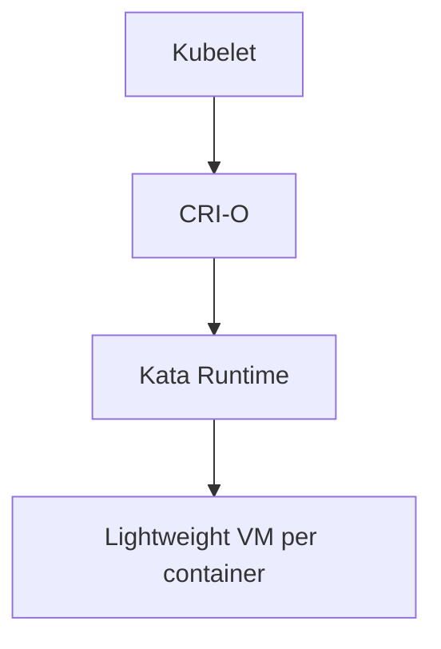

## Introduction

Container runtimes evolved into two major categories: **OCI-compatible** and
**CRI-compatible** runtimes. These standards define how containers are created,
managed, and integrated into larger systems like Docker and Kubernetes.

---

## OCI – Open Container Initiative

### What is OCI?

- A **working group** that defines **open standards** for container technology.
- Maintained by the Linux Foundation.
- Focuses on:
  - **Image Specification** (how images are packaged).
  - **Runtime Specification** (how containers are created and run).

### OCI Runtime Specification (Runtime Spec)

- Describes **what a container is** and **what a runtime must do**:
  - Create a container.
  - Start/stop it.
  - Apply isolation (namespaces, cgroups).
- Does **not dictate implementation**:
  - Allows different runtimes to implement their own way of doing these tasks.

---

## Popular OCI-Compatible Runtimes

### 1. **runc**

- Default runtime for Docker and containerd.
- Written in Go.
- Implements OCI Runtime Spec directly.
- Used as the "workhorse" for most container engines.

```bash
# Using runc manually
runc spec
runc run mycontainer
```

> Running `runc` manually creates a container from a low-level spec. Mostly used
> for debugging or education.

---

### 2. **crun**

- Maintained by Red Hat.
- Written in C → faster and smaller than runc.
- Used by **Podman** and **CRI-O**.
- Optimized for starting large numbers of containers quickly.

---

### 3. **youki**

- Written in **Rust**.
- Aimed at safety and memory efficiency.
- Newer entrant but gaining popularity.

---

### 4. **Sandboxed Runtimes (High Isolation)**

OCI also allows runtimes that run containers inside **lightweight VMs** or
**unikernels**.

- **gVisor** (Google): Intercepts syscalls, provides a user-space kernel.
- **Nabla Containers**: Uses unikernel-style isolation.
- **Kata Containers**: Runs each container inside a minimal VM.

> These provide stronger isolation, suitable for multi-tenant environments or
> untrusted workloads.

---

## CRI – Container Runtime Interface

### Why CRI Exists

- Created by the **Kubernetes project**.
- Kubernetes needed to avoid lock-in with any one runtime.
- Provides an **API standard** for Kubernetes to talk to container runtimes.

### CRI Workflow in Kubernetes

1. Kubelet (Kubernetes node agent) calls CRI.
2. CRI runtime (containerd, CRI-O) creates the container.
3. Runtime calls underlying OCI runtime (e.g., runc).

---

## Popular CRI-Compatible Runtimes

### 1. **containerd**

- Originally part of Docker, now a CNCF project.
- Acts as a **daemon** to manage containers.
- Uses **runc** by default but supports **shims**:

  - Can plug in gVisor, Kata, or others.

### 2. **CRI-O**

- Minimal runtime for Kubernetes.
- Maintained by Red Hat, Intel, etc.
- Uses OCI runtimes under the hood (runc, crun).
- Designed to integrate tightly with OpenShift.

---

## OCI vs CRI – Key Differences

| Feature    | OCI Runtime                     | CRI Runtime                 |
| ---------- | ------------------------------- | --------------------------- |
| Defined by | Open Container Initiative       | Kubernetes project          |
| Purpose    | Standardize container creation  | Standardize K8s integration |
| Spec Name  | Runtime Spec                    | Container Runtime Interface |
| Examples   | runc, crun, youki, Kata         | containerd, CRI-O           |
| Uses       | Docker, Podman, low-level tools | Kubernetes                  |

---

## Combined Flow: Docker and Kubernetes

### Docker Engine

1. Docker CLI → Docker Engine.
2. Docker Engine → containerd (CRI).
3. containerd → runc (OCI).

### Kubernetes

1. kubelet → CRI (containerd or CRI-O).
2. CRI runtime → runc (OCI) or sandboxed runtime.

---

## Example: Kubernetes with Kata Containers



> Same Kubernetes interface, but every container runs inside a VM for added
> security.

---

## Questions and Answers

### Q1: Is Docker compliant with OCI?

**A**: Yes. Docker uses `containerd` and `runc` internally, both of which are
OCI-compliant.

---

### Q2: Can CRI runtimes use non-OCI runtimes?

**A**: Typically no. Most CRI runtimes call OCI runtimes under the hood to
maintain compatibility.

---

### Q3: Why do we need both OCI and CRI?

**A**:

- OCI: Defines _what_ a container is and how to run it.
- CRI: Defines _how Kubernetes interacts_ with runtimes, enabling pluggability.

---

### Q4: Which runtime is faster – runc or crun?

**A**: `crun` is significantly faster for container start/stop operations due to
being written in C and having a smaller footprint.

---

### Q5: Why use Kata Containers or gVisor?

**A**: For stronger isolation in multi-tenant platforms, preventing kernel-level
attacks from escaping containers.

---

## Summary

- **OCI** provides standards for container images and runtimes.
- **runc**, **crun**, **youki**, and sandboxed runtimes implement the OCI spec.
- **CRI** allows Kubernetes to work with any runtime via a standard interface.
- **containerd** and **CRI-O** are the main CRI runtimes today.

These standards ensure that containers are interoperable across tools,
platforms, and orchestration systems.
