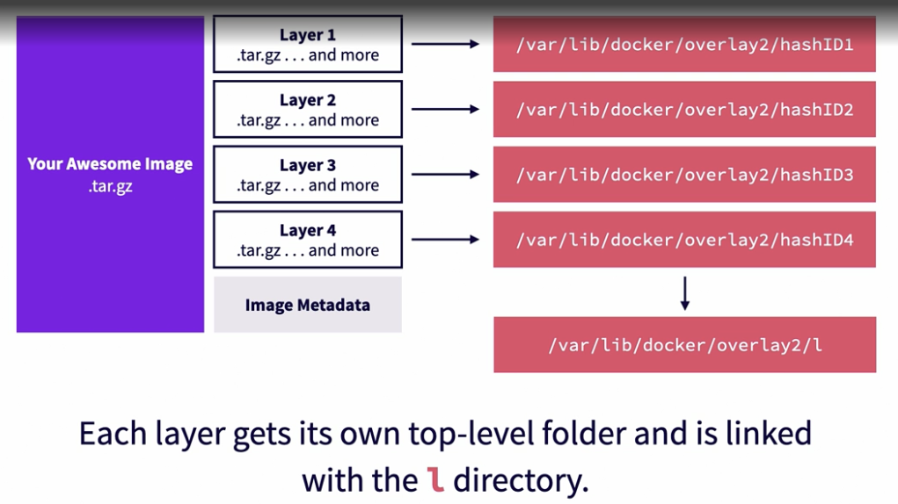

---

title: Storage Drivers in Docker and Container Runtimes
sidebar_position: 40
---------------------

## Introduction

When a container runs, it needs a **directory-based file system**, not a compressed tar archive. Storage drivers are responsible for **extracting, combining, and presenting container image layers** as a single usable file system for containers.

---

## What Are Storage Drivers?

- Define **how image layers are stored on disk**.
- Present decompressed layers to containers as a **merged root file system**.
- Handle **read-write behavior** of running containers.

Some runtimes refer to them as **graph drivers** or **snapshotters**, but they
serve the same purpose.

---

## The Problem They Solve

- Without storage drivers, every new container would require **fully extracting
  the image layers** to a separate directory.
- For large images or multiple containers, this would be extremely slow and
  inefficient.
- Storage drivers allow multiple containers to share the same base image layers
  without duplication.

---

## Overlay2 – The Most Popular Storage Driver

Docker Engine defaults to the **overlay2** driver, which uses the Linux
OverlayFS file system.

### How overlay2 Works:

1. **Layer Extraction**

   - Each image layer is decompressed into `/var/lib/docker/overlay2`.
   - Each layer gets a unique directory.

2. **Layer Directories**

   - Bottom-most layer: `diff/` and `link/`
   - Upper layers: `diff/`, `link/`, `lower/`, and `merged/`

3. **Symbolic Links**

   - Shortcuts created under `/var/lib/docker/overlay2/l` to manage layer IDs.

4. **Overlay Mount**

   - Combines lower and upper layer directories into a single unified file
     system.

5. **Upperdir vs Lowerdir**

   - **lowerdir** = Read-only base layers.
   - **upperdir** = Writable container layer.
   - Changes are written only to the **upperdir**.

---

## Copy-Up and Whiteouts

### Copy-Up:

- When modifying or deleting a file from a lower layer:

  - File is **copied up** to the upperdir first.
  - Changes are applied to this copy.

### Whiteout:

- When a file is "deleted" from a lower layer:

  - A **whiteout file** hides it without actually deleting it.
  - Similar to marking a file as inaccessible.

> **Impact:** Copy-up can introduce latency for I/O-heavy workloads like
> databases.

---

## Limitations of Storage Drivers

- **Performance:** Copy-up operations can be slow for large files.
- **Ephemeral Data:** Any data written to the container’s writable layer is lost
  when the container is deleted.

### Solutions:

- **Volumes:** Persistent storage managed by Docker.
- **Bind Mounts:** Directly map host directories into containers.

---

## Other Storage Drivers

- **aufs** (legacy, early Docker default)
- **devicemapper**
- **btrfs**
- **zfs**
- **vfs** (fallback, slow, no layering)

---

## Storage Drivers in Kubernetes

- Kubernetes relies on container runtimes (e.g., containerd, CRI-O) which use
  snapshotters like overlay2.
- Each pod’s container shares base layers across nodes to save disk space.
- Persistent storage is handled via **PersistentVolumes** and not through the
  container writable layer.

---

## Visual Representation

> _\[Placeholder: Image showing Overlay2 structure — base layers, upperdir,
> lowerdir, merged mount]_

> _\[Placeholder: Diagram showing shared layers between multiple containers to
> avoid duplication]_

> 

---

> 

---

> 

---

> 

---

> 

---

## Questions and Answers

### Q1: What happens if you delete `/var/lib/docker/overlay2`?

**A:** All images, layers, and containers are removed. This effectively resets
Docker storage.

---

### Q2: Can Windows containers use overlay2?

**A:** No. Overlay2 is Linux-specific. Windows uses its own storage backend.

---

### Q3: Why are volumes recommended for databases?

**A:** Volumes bypass copy-up/whiteout overhead and persist data independently
of the container lifecycle.

---

### Q4: Are storage drivers the same as container runtimes?

**A:** No. Storage drivers are used **by** container runtimes to manage layers
on disk.

---

### Q5: Can you change the storage driver?

**A:** Yes, by modifying `/etc/docker/daemon.json`:

```json
{
  "storage-driver": "overlay2"
}
```

Restart Docker after making changes.
