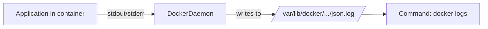
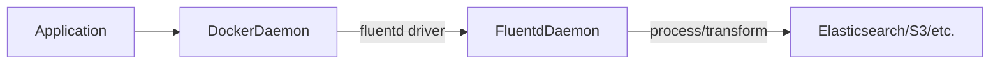

## Summary

This section explores **how Docker captures logs from containers** using **logging drivers**. It introduces the concept of `stdout` and `stderr`, discusses **Docker's default logging behavior**, and explains how different **log drivers** can route output to various destinations (disk, external log aggregators, etc.). The section focuses especially on the default `json-file` driver and how to configure alternative drivers and logging modes like `non-blocking`.

---

## Key Concepts

### 1. **Linux I/O Streams: stdout and stderr**

- Every application running on Linux has access to:
  - `stdout` (standard out): for informational messages.
  - `stderr` (standard error): for error messages.
  - `stdin`: for accepting input (not covered here).
- These are also known as **streams** and are essential for **container logging**.

### 2. **Docker’s Logging Drivers**

Docker uses **logging drivers** to collect and route output written to `stdout` and `stderr`.

- A **logging driver** is a program/module that:
  - Captures container logs from these streams.
  - Routes them to a destination (file, external tool, cloud service).

### 3. **How to Set Logging Drivers**

You can specify a logging driver while starting a container:

```bash
docker run --log-driver=json-file my-container
````

You can also set **driver-specific options** using `--log-opt`, e.g.:

```bash
docker run \
  --log-driver=json-file \
  --log-opt max-size=10m \
  --log-opt max-file=3 \
  my-container
```

| Flag           | Description                                 |
| -------------- | ------------------------------------------- |
| `--log-driver` | Sets the logging driver to use              |
| `--log-opt`    | Key-value pairs for driver-specific options |

---

## Blocking vs Non-blocking Logging

* By **default**, logging is **blocking**:
  Application pauses while log is processed.

* To improve performance and reduce delay:

```bash
--log-opt mode=non-blocking
```

> ⚠️ **Risk**: May result in **log data loss** if log buffer fills up.

---

## Default Docker Logging Driver: `json-file`

Docker uses the `json-file` driver by default.

* Stores logs in JSON format under `/var/lib/docker/containers/<id>/...`
* Each log message is stored as a **JSON object** with:

  * Timestamp
  * Message
  * Container ID
  * Stream (stdout/stderr)

### Example log entry in `json-file`:

```json
{
  "log": "Hello from container\n",
  "stream": "stdout",
  "time": "2025-08-18T18:50:20.123456789Z"
}
```

This structured format allows tools to:

* Filter logs by date, container, message.
* Send logs to parsing/aggregation tools (e.g., Fluentd, Logstash).

---

## Common Docker Logging Drivers

| Driver      | Destination                 | Notes                                   |
| ----------- | --------------------------- | --------------------------------------- |
| `json-file` | Local disk (default)        | Good for local debugging                |
| `syslog`    | Host syslog daemon          | Can forward to remote syslog servers    |
| `journald`  | systemd journal             | Used in systems with `systemd`          |
| `fluentd`   | Fluentd daemon              | Powerful log routing and transformation |
| `awslogs`   | AWS CloudWatch Logs         | For AWS environments                    |
| `gelf`      | Graylog Extended Log Format | For Graylog logging systems             |
| `splunk`    | Splunk                      | Enterprise-grade log aggregation        |
| `none`      | Disables logging completely | Useful for performance-sensitive tasks  |

You can explore more logging drivers on [Docker’s official logging driver docs](https://docs.docker.com/config/containers/logging/configure/).

---

## Missing Concepts Explained

### 1. **Where are logs stored?**

For `json-file` driver, logs are stored in:

```bash
/var/lib/docker/containers/<container-id>/<container-id>-json.log
```

Use `docker inspect <container>` to find the exact path.

---

### 2. **How to view logs?**

```bash
docker logs <container-name>
```

* Shows both `stdout` and `stderr`.
* Useful for debugging failed containers.

---

### 3. **Visualizing the Logging Flow**

#### Log Flow with `json-file` Driver



#### Log Flow with Remote Aggregator (e.g., Fluentd)



---

## Open-Source Visual Reference

### Docker Logging Pipeline


> Source: [Docker Official Documentation](https://docs.docker.com/config/containers/logging/configure/)

---

## Quiz & Practice Questions

### Q1. What is the default logging driver in Docker?

* A. `none`
* B. `json-file` ✅
* C. `fluentd`
* D. `syslog`

🟩 **Answer:** B
📝 **Explanation:** Docker uses the `json-file` driver by default to log container output into JSON-structured files on disk.

---

### Q2. Which flag enables non-blocking logging?

* A. `--log-opt async=true`
* B. `--log-driver=none`
* C. `--log-opt mode=non-blocking` ✅
* D. `--log-block=false`

🟩 **Answer:** C
📝 **Explanation:** The correct option is `--log-opt mode=non-blocking`, which allows logs to be collected without blocking container execution.

---

### Q3. Why might `non-blocking` logging cause data loss?

* A. Because Docker doesn't write logs at all
* B. Because log buffer might overflow before being flushed ✅
* C. Because Docker deletes old logs instantly
* D. Because of CPU throttling

🟩 **Answer:** B
📝 **Explanation:** When in non-blocking mode, if the buffer fills up and logs are not processed fast enough, new logs may be dropped to maintain performance.

---

## Final Notes

* Always choose logging drivers depending on your **observability platform**.
* Use `non-blocking` mode cautiously—only when performance is more critical than guaranteed logging.
* Consider using remote log aggregators for production systems (Fluentd, Splunk, AWS CloudWatch).

