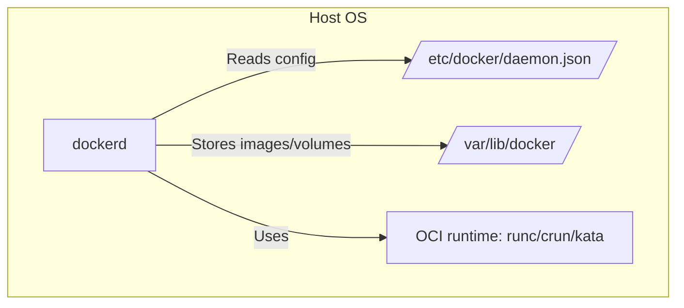

## Summary

This section explains how to **configure the Docker daemon (`dockerd`)**,
including its runtime options, file locations, and logging levels. It describes
how to control the Docker daemon using command-line flags and the `daemon.json`
configuration file, with emphasis on important options like `--data-root`,
`--config-file`, `--log-level`, and `--default-runtime`.

---

## Key Concepts

### 1. **What is the Docker Daemon?**

- The Docker daemon is a background service named `dockerd` that manages:

  - Containers
  - Images
  - Volumes
  - Networks

- It is launched by the system's init system (e.g., `systemd` on Linux).

```bash
ps -ef | grep docker
```

````

> This command shows the running `dockerd` process.

---

### 2. **Docker Daemon Configuration File**

- Default config file location:

```bash
/etc/docker/daemon.json
```

- Example config:

```json
{
  "log-level": "warn",
  "insecure-registries": ["my-priv-reg.local:5000", "another.local"]
}
```

- You can specify a custom path using:

```bash
dockerd --config-file=/custom/path/daemon.json
```

---

### 3. **Useful Docker Daemon Flags**

| Flag                | Description                                                                      |
| ------------------- | -------------------------------------------------------------------------------- |
| `--config-file`     | Sets path to configuration JSON file                                             |
| `--data-root`       | Changes the path where Docker stores all its data (`/var/lib/docker` by default) |
| `--debug`           | Enables verbose debugging output                                                 |
| `--log-level`       | Sets logging verbosity: `debug`, `info`, `warn`, `error`, `fatal`                |
| `--add-runtime`     | Adds an alternate container runtime like `crun` or `kata`                        |
| `--default-runtime` | Sets the default OCI runtime (default is `runc`)                                 |
| `--exec-opt`        | Sets advanced execution options for runtime                                      |

---

### 4. **Where Docker Stores Data**

- By default:

```bash
/var/lib/docker
```

This contains all:

- Container metadata
- Images
- Volumes
- Network settings

You can override this using:

```bash
dockerd --data-root /custom/docker-data
```

---

### 5. **Alternate Runtimes**

Docker supports multiple OCI-compliant runtimes:

| Runtime        | Description                     |
| -------------- | ------------------------------- |
| `runc`         | Default runtime (lightweight)   |
| `crun`         | Faster, smaller, systemd-native |
| `kata-runtime` | Secure runtime using VMs        |

You can configure them via:

```bash
dockerd \
  --add-runtime crun=/usr/bin/crun \
  --default-runtime=crun
```

Or using `daemon.json`:

```json
{
  "runtimes": {
    "crun": {
      "path": "/usr/bin/crun"
    }
  },
  "default-runtime": "crun"
}
```

---

## Visual Diagram: Docker Daemon Configuration Flow



---

## Missing Concepts Explained

### 🔍 What is `dockerd`?

- `dockerd` is the core engine that runs in the background and handles:

  - Image management
  - Container lifecycle
  - Logging
  - Volume/network orchestration

It communicates via the **Docker API** over a UNIX socket
(`/var/run/docker.sock`).

---

### 🔐 Why Configure Daemon?

- Set **insecure registries** during local dev
- Enable **custom runtimes** (e.g., for more security)
- Change default storage path (e.g., limited root partition)
- Increase log verbosity for debugging

---

## Quiz Questions

### Q1. What is the default location of Docker's configuration file?

- A. `/usr/docker/config.json`
- B. `/etc/docker/daemon.json` ✅
- C. `/docker/daemon/settings.json`
- D. `/usr/lib/docker/docker.json`

🟩 **Answer:** B 📝 Docker reads daemon settings from `/etc/docker/daemon.json`
by default.

---

### Q2. What does `--data-root` flag do in Docker?

- A. Sets Docker's container network bridge
- B. Changes the location for Docker CLI configs
- C. Changes where Docker stores containers and images ✅
- D. Sets the root user inside a container

🟩 **Answer:** C 📝 The `--data-root` flag changes where Docker stores internal
data like images, containers, volumes.

---

### Q3. Which flag enables debugging output for dockerd?

- A. `--enable-debug`
- B. `--log-mode=debug`
- C. `--debug` ✅
- D. `--debug-logs=true`

🟩 **Answer:** C 📝 Use `--debug` to enable verbose debug logs from the Docker
daemon.

---

### Q4. How do you specify an alternate container runtime?

- A. `--runtime-path`
- B. `--add-runtime` ✅
- C. `--set-runtime`
- D. `--runtime-alias`

🟩 **Answer:** B 📝 `--add-runtime` lets you register an OCI-compliant runtime
like crun or kata with Docker.

---

## Further Reading

- 🔗
  [Docker dockerd CLI reference](https://docs.docker.com/engine/reference/commandline/dockerd/)
- 🔗
  [Daemon configuration file reference](https://docs.docker.com/engine/reference/commandline/dockerd/#daemon-configuration-file)
- 🔗
  [Custom runtimes with Docker](https://docs.docker.com/engine/reference/commandline/dockerd/#custom-runtimes)

````
