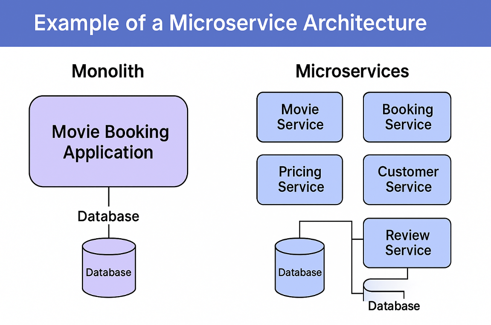

# 🎬 Microservice Architecture Example: Movie Booking Application

In this step, let’s walk through how a real-world application like a **Movie Booking System** can be designed in both **monolithic** and **microservice** architectures.

---

## 🏗️ Monolithic Architecture: One Big App

In a **monolith**, everything is bundled into a single application:
- One shared codebase
- One database
- All features (booking, pricing, user profile, etc.) exist in a **single deployable unit**

### 🔍 Characteristics:
- Tightly coupled logic
- Centralized database
- Complex deployments

---

## 🧩 Microservices Architecture: Decoupled Services

In contrast, a **microservices** approach divides the movie booking system into multiple independent services. Each microservice focuses on a **specific functionality** and is **independently deployable**.

### 📦 Example Microservices:

| Microservice        | Responsibility                                                       |
|---------------------|----------------------------------------------------------------------|
| 🎥 **Movie Service**    | Manages movie details, showtimes, and availability                 |
| 🎫 **Booking Service**  | Handles seat selection, ticket booking, and booking management     |
| 💰 **Pricing Service**  | Manages ticket pricing, discounts, and special offers              |
| 👤 **Customer Service** | Manages user profiles, authentication, and support-related tasks   |
| 🌟 **Review Service**   | Handles user-submitted reviews, ratings, and movie comments         |

> You may have **many more services** depending on how granular your design needs to be.

---

## 🧠 Design Tip: Define Clear Boundaries

A key challenge in microservice architecture is defining what each service **should and should not do**.

- Services must be **small**, **cohesive**, and **focused**.
- Each should have **clearly defined ownership** over part of the business logic.
- Reuse across services should happen through **API contracts**, not shared databases or internal calls.

---

## 🧰 Architecture Diagram

You can use this side-by-side visualization to grasp the difference:

---

## ✅ Summary

| Feature                   | Monolith                                | Microservices                            |
|---------------------------|------------------------------------------|------------------------------------------|
| Codebase                  | Single codebase                          | Multiple independent services            |
| Deployment                | All-or-nothing                           | Independent per service                  |
| Scalability               | Whole app                                | Per service                              |
| Technology Choices        | Uniform (e.g., Java only)                | Polyglot (Java, Python, Node.js, etc.)   |
| Database                  | Shared                                   | Decentralized or per-service             |

---

## ❓ Q&A

### ❓ What are the five example microservices in the movie app?
**Answer**: Movie, Booking, Pricing, Customer, and Review Services.

---

### ❓ What is the challenge of identifying microservices?
**Answer**: Defining **clear and focused responsibilities** for each service without overlapping roles.

---

### ❓ Can each service use its own database?
**Answer**: Yes. In fact, it is encouraged for **loose coupling** and **service autonomy**.

---

### ❓ Can microservices be written in different languages?
**Answer**: Yes. This is called a **polyglot architecture**, allowing you to choose the best tool for the job.

---

### ❓ Why is independent deployability important?
**Answer**: It enables **faster release cycles**, **reduced risk**, and **better team autonomy**.

---