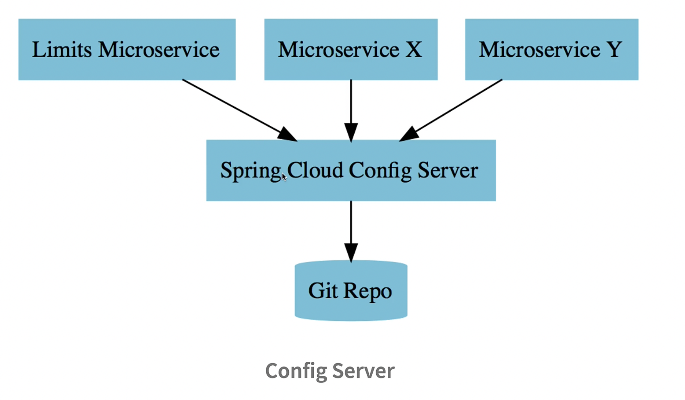

# 🛠️ Creating the Limits Microservice

## Architecture for the project


In this step, you'll build your **first microservice** — the `limits-service`.
This microservice will later be integrated with the **Spring Cloud Config
Server** to retrieve configuration values from a **central Git repository**.

---

## 🚀 Step 1: Generate Project with Spring Initializr

Go to [start.spring.io](https://start.spring.io/) and configure the project:

| Field           | Value                                 |
| --------------- | ------------------------------------- |
| **Project**     | Maven                                 |
| **Language**    | Java                                  |
| **Spring Boot** | Latest stable release (not snapshots) |
| **Group**       | `com.in28minutes.microservices`       |
| **Artifact**    | `limits-service`                      |

### 📦 Add Dependencies:

- **Spring Web** – for building REST APIs
- **Spring Boot DevTools** – for auto-restart during development
- **Spring Boot Actuator** – for monitoring endpoints
- **Spring Cloud Config Client** – to connect with Config Server

Click **Generate** to download a `.zip`, extract it, and import it into your IDE
(e.g., Eclipse or IntelliJ).

---

## 📁 Step 2: Import as Maven Project

In Eclipse:

- Select: `File > Import > Existing Maven Projects`
- Choose the extracted `limits-service` folder
- Click `Finish`

💡 **Note**: Initial import may take 5–10 minutes if you're using a new Spring
Boot version for the first time.

---

## 🧾 Step 3: Verify `pom.xml` Dependencies

Open `pom.xml` and ensure these dependencies are present:

```xml
<dependencies>
    <dependency>
        <groupId>org.springframework.boot</groupId>
        <artifactId>spring-boot-starter-web</artifactId>
    </dependency>
    <dependency>
        <groupId>org.springframework.boot</groupId>
        <artifactId>spring-boot-starter-actuator</artifactId>
    </dependency>
    <dependency>
        <groupId>org.springframework.cloud</groupId>
        <artifactId>spring-cloud-starter-config</artifactId>
    </dependency>
    <dependency>
        <groupId>org.springframework.boot</groupId>
        <artifactId>spring-boot-devtools</artifactId>
        <scope>runtime</scope>
    </dependency>
</dependencies>
```

These dependencies enable REST, monitoring, and configuration management.

---

## ⚙️ Step 4: Configure `application.properties`

Navigate to `src/main/resources/application.properties` and add:

```properties
spring.config.import=optional:configserver:http://localhost:8888
```

📌 This line tells the application to **optionally** load config from a Spring
Cloud Config Server located at port `8888`.

We're using `optional:` because the config server isn’t set up yet. Once it's
running, this microservice will pull its config from there.

---

## ▶️ Step 5: Run the Limits Microservice

Right-click the main class (e.g., `LimitsServiceApplication.java`) and choose:

```
Run As > Java Application
```

This should start the service on the default port (`8080`), although you can
override it later via configuration.

---

## ⚠️ Important Tips

### 💡 Avoid Spaces in Folder Path

Ensure your project path does **not contain spaces**. Some tools (like Git or
config server integrations) may break due to space characters in paths.

If you have a space in your directory name (e.g., `My Projects/limits-service`):

1. Delete the project
2. Move it to a clean path like `~/projects/limits-service`
3. Re-import the project

---

## ✅ Summary

| Task                         | Description                                              |
| ---------------------------- | -------------------------------------------------------- |
| Spring Boot App              | Created with REST, Actuator, DevTools, and Config Client |
| Config Server URL            | Setup in `application.properties` as optional import     |
| Maven Project Imported       | Via Eclipse or any preferred IDE                         |
| Ready for Config Integration | Next step: connect to Git-based centralized config       |

---

## ❓ Q&A

### ❓ Why use `spring.config.import=optional:configserver`?

**Answer**: It allows the app to run even if the Config Server is temporarily
unavailable—useful during development.

---

### ❓ Why is artifact ID important in a microservices course?

**Answer**: When following a multi-service tutorial, consistent artifact IDs
help clearly reference each service by name.

---

### ❓ What happens if I omit the config client dependency?

**Answer**: Your microservice won’t be able to communicate with the Spring Cloud
Config Server and retrieve external configurations.

---

### ❓ Can I run the app without the Config Server running?

**Answer**: Yes, if you've marked the config server import as optional, the app
will run with local defaults.

---
