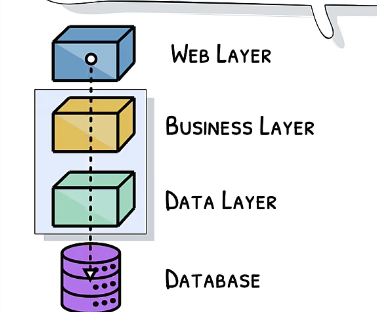

---

# Topic 1: Web Services

Web Services form the backbone of modern distributed applications by enabling diverse systems to communicate over networks. In this session, we’ll explore Web Services from the ground up. I’ll break the topic into several subtopics, each illustrated with multiple examples.

---

## 1.1. Definition and Purpose of Web Services

**What are Web Services?**  
Web services are software systems designed to support interoperable machine-to-machine interaction over a network. They use standardized protocols to allow different applications, regardless of the programming language or platform, to exchange data.

**Purpose:**  
- **Interoperability:** Enable disparate systems to communicate (e.g., a Java system talking to a .NET system).  
- **Loose Coupling:** Decouple client and server implementations, allowing each to evolve independently.  
- **Reusability:** Expose business functionality as services that can be reused across multiple applications.  
- **Standardization:** Rely on open standards (HTTP, XML, JSON) to promote widespread adoption.

**Example 1:**  
Imagine an online retailer that uses one system for processing orders (written in Java) and another for managing inventory (written in Python). A web service can allow the order system to send a request to the inventory system to check stock levels without either system needing to understand the other’s internal workings.

**Example 2:**  
A weather application might use a public web service provided by a meteorological organization. The service accepts a location (e.g., latitude and longitude) and returns current weather data in a standardized format like JSON.

---

## 1.2. Protocols and Data Formats

Web services generally fall into a few major categories based on the protocol and style of communication. Let’s examine the three primary approaches: SOAP, REST, and GraphQL.

### 1.2.1. SOAP (Simple Object Access Protocol)

**Overview:**  
SOAP is a protocol that defines a standardized way to structure messages (using XML) for exchanging information. It includes built-in error handling, security (WS-Security), and transaction management.

**Key Components:**  
- **Envelope:** The root element that defines the message structure.  
- **Header:** Optional element for metadata (security tokens, transaction IDs, etc.).  
- **Body:** Contains the actual message payload (the data you’re sending).
- **WSDL (Web Services Description Language):** An XML-based language that describes the service’s endpoints, methods, and message formats.

**Example 1 (SOAP Request Envelope):**  
```xml
<soapenv:Envelope xmlns:soapenv="http://schemas.xmlsoap.org/soap/envelope/"
                  xmlns:ex="http://example.com/webservices">
  <soapenv:Header>
    <ex:AuthToken>ABC123TOKEN</ex:AuthToken>
  </soapenv:Header>
  <soapenv:Body>
    <ex:GetWeather>
      <ex:Location>New York</ex:Location>
    </ex:GetWeather>
  </soapenv:Body>
</soapenv:Envelope>
```

**Example 2 (SOAP Response Envelope):**  
```xml
<soapenv:Envelope xmlns:soapenv="http://schemas.xmlsoap.org/soap/envelope/">
  <soapenv:Body>
    <ex:GetWeatherResponse xmlns:ex="http://example.com/webservices">
      <ex:Temperature>15</ex:Temperature>
      <ex:Condition>Cloudy</ex:Condition>
    </ex:GetWeatherResponse>
  </soapenv:Body>
</soapenv:Envelope>
```

**Example 3 (WSDL Snippet):**  
```xml
<definitions name="WeatherService"
             targetNamespace="http://example.com/webservices"
             xmlns:tns="http://example.com/webservices"
             xmlns:soap="http://schemas.xmlsoap.org/wsdl/soap/"
             xmlns:xsd="http://www.w3.org/2001/XMLSchema">
  <!-- Types, messages, portTypes, and bindings definitions -->
</definitions>
```

*Additional Examples (4–10):*  
- **Example 4:** A SOAP fault message showing error handling.  
- **Example 5:** A detailed WSDL that describes multiple operations (GetWeather, GetForecast).  
- **Example 6:** A SOAP header with multiple authentication tokens.  
- **Example 7:** A SOAP message using WS-Security to encrypt data.  
- **Example 8:** A client code snippet in Java using JAX-WS to consume a SOAP service.  
- **Example 9:** A SOAP service endpoint configuration in Apache CXF.  
- **Example 10:** A real-world scenario where a banking application uses SOAP for secure transactions.

### 1.2.2. REST (Representational State Transfer)

**Overview:**  
REST is an architectural style that uses standard HTTP methods to work with resources identified by URLs. It is stateless and leverages HTTP status codes for error handling. Data is typically exchanged in JSON or XML format.

**Key Characteristics:**  
- **Resources:** Entities like users, orders, or products.  
- **HTTP Methods:**  
  - GET (retrieve), POST (create), PUT/PATCH (update), DELETE (remove).  
- **Stateless Communication:** Each request contains all necessary information.
- **HATEOAS (Hypermedia as the Engine of Application State):** Optionally, responses may include hyperlinks to related actions.

**Example 1 (GET Request):**  
```http
GET /api/users/123 HTTP/1.1
Host: example.com
Accept: application/json
```

**Example 2 (GET Response):**  
```json
{
  "id": 123,
  "name": "John Doe",
  "email": "john.doe@example.com"
}
```

**Example 3 (POST Request to Create a Resource):**  
```http
POST /api/users HTTP/1.1
Host: example.com
Content-Type: application/json

{
  "name": "Jane Doe",
  "email": "jane.doe@example.com"
}
```

**Example 4 (POST Response):**  
```http
HTTP/1.1 201 Created
Location: /api/users/124
```

**Example 5 (PUT Request to Update a Resource):**  
```http
PUT /api/users/123 HTTP/1.1
Host: example.com
Content-Type: application/json

{
  "name": "Johnathan Doe",
  "email": "john.doe@example.com"
}
```

**Example 6 (DELETE Request):**  
```http
DELETE /api/users/123 HTTP/1.1
Host: example.com
```

**Example 7 (Error Handling):**  
```http
HTTP/1.1 404 Not Found
Content-Type: application/json

{
  "error": "User not found"
}
```

**Example 8 (HATEOAS Response):**  
```json
{
  "id": 123,
  "name": "John Doe",
  "links": [
    { "rel": "self", "href": "http://example.com/api/users/123" },
    { "rel": "orders", "href": "http://example.com/api/users/123/orders" }
  ]
}
```

**Example 9 (Filtering and Pagination):**  
```http
GET /api/users?limit=10&offset=20 HTTP/1.1
Host: example.com
```

**Example 10 (Versioning via URL):**  
```http
GET /api/v1/users/123 HTTP/1.1
Host: example.com
```

### 1.2.3. GraphQL

**Overview:**  
GraphQL is an alternative to REST developed by Facebook. It allows clients to request exactly the data they need and nothing more. It supports both queries (to retrieve data) and mutations (to modify data).

**Key Characteristics:**  
- **Single Endpoint:** Unlike REST, all queries are sent to one endpoint (e.g., `/graphql`).
- **Client-Specified Queries:** The client can specify the exact shape of the response.
- **Introspection:** Clients can query the schema to understand the API’s capabilities.

**Example 1 (GraphQL Query):**  
```graphql
query {
  user(id: "123") {
    id
    name
    email
  }
}
```

**Example 2 (GraphQL Response):**  
```json
{
  "data": {
    "user": {
      "id": "123",
      "name": "John Doe",
      "email": "john.doe@example.com"
    }
  }
}
```

**Example 3 (GraphQL Mutation):**  
```graphql
mutation {
  createUser(name: "Jane Doe", email: "jane.doe@example.com") {
    id
    name
    email
  }
}
```

**Example 4 (GraphQL Mutation Response):**  
```json
{
  "data": {
    "createUser": {
      "id": "124",
      "name": "Jane Doe",
      "email": "jane.doe@example.com"
    }
  }
}
```

**Example 5 (Complex Query with Nested Data):**  
```graphql
query {
  user(id: "123") {
    id
    name
    posts {
      title
      content
    }
  }
}
```

**Example 6 (Using Fragments):**  
```graphql
fragment userFields on User {
  id
  name
  email
}

query {
  user(id: "123") {
    ...userFields
    posts {
      title
    }
  }
}
```

**Example 7 (Query with Variables):**  
```graphql
query GetUser($userId: ID!) {
  user(id: $userId) {
    id
    name
    email
  }
}
```
*Variables:*
```json
{ "userId": "123" }
```

**Example 8 (Error Handling in GraphQL):**  
```json
{
  "errors": [
    {
      "message": "User not found",
      "locations": [{ "line": 2, "column": 3 }],
      "path": ["user"]
    }
  ],
  "data": { "user": null }
}
```

**Example 9 (Schema Introspection Query):**  
```graphql
{
  __schema {
    types {
      name
    }
  }
}
```

**Example 10 (Using Directives):**  
```graphql
query getUser($includeEmail: Boolean!) {
  user(id: "123") {
    id
    name
    email @include(if: $includeEmail)
  }
}
```

---

## 1.3. Security, Error Handling, and Best Practices

### Security Aspects:
- **Authentication and Authorization:**  
  - Web services can use OAuth, API keys, or even certificates to secure endpoints.
- **Data Encryption:**  
  - Use HTTPS/TLS to encrypt data in transit.
- **Input Validation:**  
  - Always validate incoming data to prevent injection attacks.
- **Example (Securing a REST Endpoint):**  
  - A REST API endpoint that requires an OAuth2 token and validates it before processing the request.

### Error Handling:
- **SOAP Faults:**  
  - SOAP has a built-in mechanism for returning fault messages in a standardized way.
- **REST Error Codes:**  
  - Use appropriate HTTP status codes and return error details in a JSON response.
- **GraphQL Errors:**  
  - Errors are included in an `"errors"` array in the response, allowing partial data return when possible.
- **Example (Custom Error Message in REST):**  
  ```json
  {
    "error": "Invalid input: 'email' field must be a valid email address."
  }
  ```

### Best Practices:
- **Versioning:**  
  - Always plan for changes by versioning your APIs (e.g., via URI, headers, or media types).
- **Documentation:**  
  - Keep your API documentation up to date using tools like Swagger/OpenAPI (for REST) or GraphQL Playground.
- **Testing:**  
  - Write thorough unit and integration tests to ensure API reliability.
- **Example (API Documentation Tool):**  
  - Using Swagger UI to generate interactive documentation from an OpenAPI specification file.

---

## 1.4. Reflection and Interactive Questions

Now that you’ve seen an in‑depth explanation of Web Services along with many examples covering SOAP, REST, and GraphQL, here are some questions for you to reflect on and answer:

1. **Comparing Protocols:**  
   - What are the main advantages and disadvantages of SOAP compared to REST in your view?  
2. **Interoperability:**  
   - How would you design a web service that needs to communicate between a Java backend and a Python client? What protocol and data format would you choose, and why?  
3. **GraphQL Use Cases:**  
   - Can you think of a scenario where GraphQL would be a better choice than REST?  
4. **Security:**  
   - How would you secure a REST API that exposes sensitive user data? What authentication method would you use?  
5. **Error Handling:**  
   - Describe how you would handle errors in a RESTful service. What HTTP status codes and message formats would you consider essential?

---